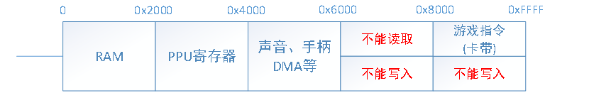
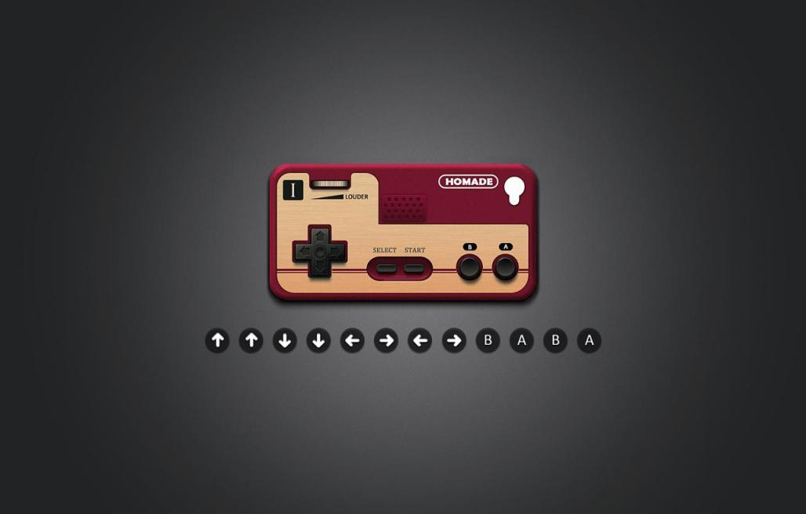

# NES 硬件简述

*2021/05/13 NZL*

作为一款80年代的8位机，FC的性能比起如今的机器可谓是捉襟见肘：

## 一、CPU

FC使用8位的6502 CPU，主频仅有1.79MHZ。它包含三个通用寄存器A、X、Y，三个专用寄存器PSW（状态寄存器）、SP（栈指针）、PC（程序计数器），除了PC是16位以外，其余的均为8位寄存器。

## 二、内存

16位的寻址空间，理论上应该有64KB的内存，但实际上只有2KB的可用内存。其余部分要么没有接线（被用于镜像存储前2KB的内容），要么被映射为I/O寄存器，或卡带的ROM/RAM空间。具体可见下图：

## 三、PPU（图形处理单元）

PPU可以理解为当今的显卡，它支持渲染256*240像素的屏幕大小，具体由8x8的“瓦片”（tile）构成背景，和最高64个8x8或8x16的“精灵”（Sprite，指游戏中可以移动的物体，又称活动块）组成。它支持像素级别的“滚动”

## 四、APU（音频处理单元）

APU支持2个方波、1个三角波、1个噪声和1个DMC（增量调制）。

## 五、控制器

经典的FC控制器如下图所示：

## 六、卡带

FC卡带分为很多种类。早期的FC卡带受限于64KB的寻址空间，因此最大仅有64KB。在FC的中后期，添加了Mapper支持，它支持卡带地址的映射转换，从而能够读取更多的内容。但是Mapper的格式并不唯一，FC历史上一共出现过Mapper0-Mapper7，多数游戏仅需要Mapper0-Mapper4即可支持。
扩展的卡带有时带有自己的内存（电池供电battery-backed RAM），甚至自己的APU部件，因此想要完整实现对FC的模拟是有难度的，好在我们可以仅实现部分功能。