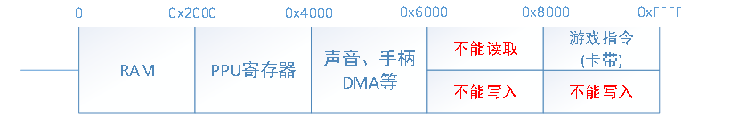

# FC 运作流程

上图为FC主要部分的总线图。在游戏的运行过程中，CPU会不断地通过总线从卡带中获取游戏指令，执行指令，然后将关键变量（当前关卡，剩余生命）写入内存。CPU还会通过总线向PPU输出“字模”的排列方式，PPU再从卡带中读取图案表，按照CPU给定的排列方式排列最终实现画面输出。
有关PPU的部分我们之后再详细叙述，首要应当完成的应该是CPU、RAM、卡带部分，因为这一部分是数据来源，下面我们进一步对相关部分进行解析。

## 一、CPU总线
总线的作用是连接CPU和各个部件，当CPU需要获取指令或操作数时，会向总线发送一个16bit的地址，总线根据地址映射关系（下图2）找到相应器件，从器件的对应位置获取到一个8bit的数据，传回给CPU。（CPU写出过程类似，不再赘述）

注：上述地址关系仅为大体内容，各部分还有更为详细的地址-功能关系，在实现各部分时会提到。

## 二、RAM
简介时说过，FC的基础RAM仅有2KB，在此基础之上还有细分：
最初的256B被称为零页，其作用相当于寄存器（因为寻址方式不同，所以CPU在该部分存取较快）；后256B为栈，当发生中断时，会将关键寄存器上的数保存至栈中，返回时恢复现场；最后1.5KB没有特殊用途。
然而我们并不需要区分这2KB，因为现在的内存速度今非昔比，直接建立2KB的数组即可。

## 三、CPU
CPU包含1个ALU、6个寄存器，下面描述各个寄存器的作用：

### 3.1 寄存器

- A：8位累加寄存器A，常用于ALU运算
- X：8位变址寄存器X，它可以非常方便地加1或减1，常用于数据传送，运算等等
- Y：同X。
- SP：8位栈指针寄存器，指向栈顶位置
- PC：16位程序计数器，其数值是“下一条要执行指令”的地址。
- P：状态寄存器，存储当前CPU的状态，包括：
    1. Carry（进位标志）：结果最高位有进位则C=1，否则C=0
    2. Zero（零标志）：结果是否为0，为0则Z=1，否则Z=0
    3. I（禁用中断）：是否允许系统中断IRQ=1时禁止，=0时允许
    4. D（十进制标志）：为1表示十进制模式，为0表示16进制模式（FC不使用）
    5. B（中断标志）：用于判别中断是由BRK指令引起还是实际的中断引起
    6. U（未使用标志）：初始状态，表示未使用（另有一说为扩展位）
    7. V（溢出标志）：若产生溢出则V=1,否则V=0
    8. N（负标志）：指令指行完后为负(>7F)则为1，否则为0

### 3.2 CPU工作流程

1. 执行获取指令、获取操作数、执行指令这个过程
2. 执行完毕后，休眠若干个时钟周期（因为真实的CPU执行每条指令需要花费若干时钟周期，而我们现在的CPU执行速度过快，需要等待）
3. 回到1

### 3.3 中断处理

FC触发中断的情况分为以下三种：
1. 当游戏的一帧画面渲染完毕后，就会通过中断机制（NMI）告知CPU，以执行相应处理。
2. 游戏指令主动触发中断（BRK）
3. 音频模块、部分游戏卡带也会触发中断（IRQ或NMI）
进入中断时，CPU会根据SP寄存器的内容，将PC和P中的内容存到栈中对应位置，然后根据中断种类找到中断程序的入口地址赋予PC，接着执行中断处理程序。退出中断时，从栈中恢复中断前的PC和P，继续执行中断之前的指令。

我们在模拟过程中，只需要模拟进入和退出中断的过程即可，执行中断处理程序的过程和一般程序一致。

