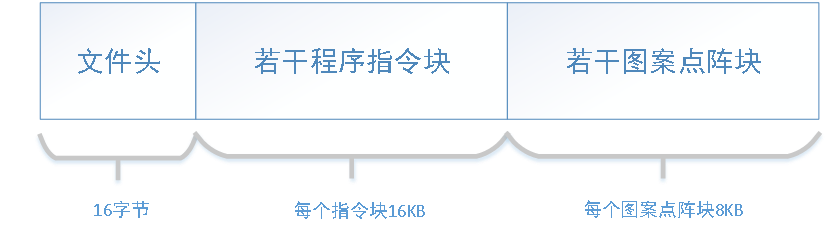
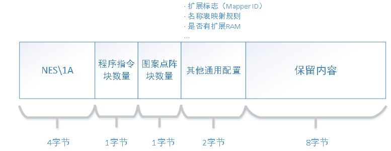
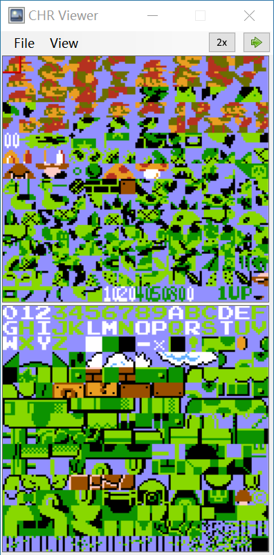

# FC卡带

## 一、基本组成部分

### 1、Mapper Id

FC卡带上自带的额外扩展的芯片Mapper的id，后面再详细介绍。

### 2、CHR-ROM/VROM

即Charater-ROM, 这部分就是存储的游戏中所需要用到的图像信息，或者换个说法，也就是常说的字体库。程序包那么小的体积，存图片肯定是不现实的，它是存储游戏中背景和精灵需要引用的图案的点阵，需要装载到显存。

### 3、PRG-ROM

即Program-ROM，这部分存储的就是游戏程序编译后的二进制代码，需要装载到主内存。

### 4、Mirroring-Type

镜像类型，主要是决定了程序运行过程显存中存储的背景渲染信息的那部分内存是如何规划，在PPU部分再详细解释。

## 二、具体文件结构

对于图案表，它由一个个8x8的像素点阵组成，每个像素点有4种可能的颜色（二进制两位表示），因此一个点阵的总大小为8x8x2=128位=16字节。前八字节为64个像素的低位，后八字节为64个像素的高位，将高位与低位组合即可得到点阵中每个像素点的颜色编号。如何通过这些图案组成游戏画面，见PPU。

