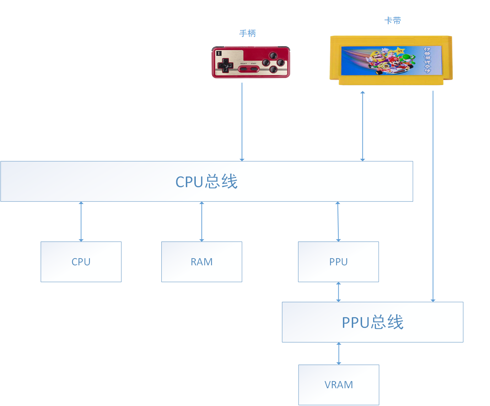
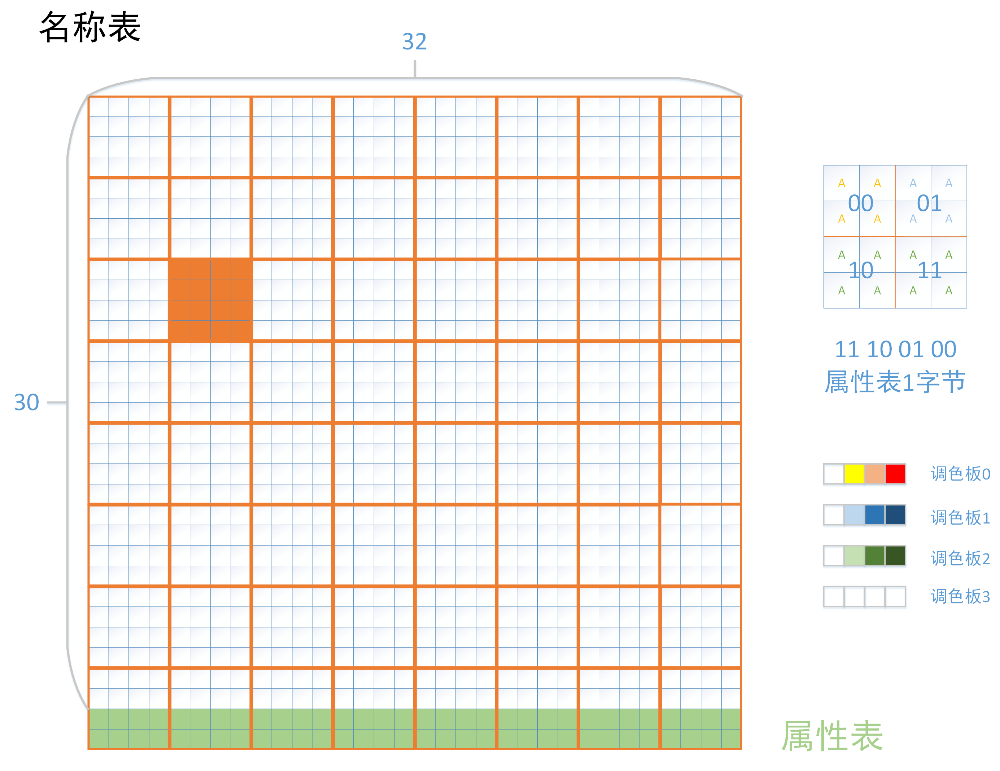
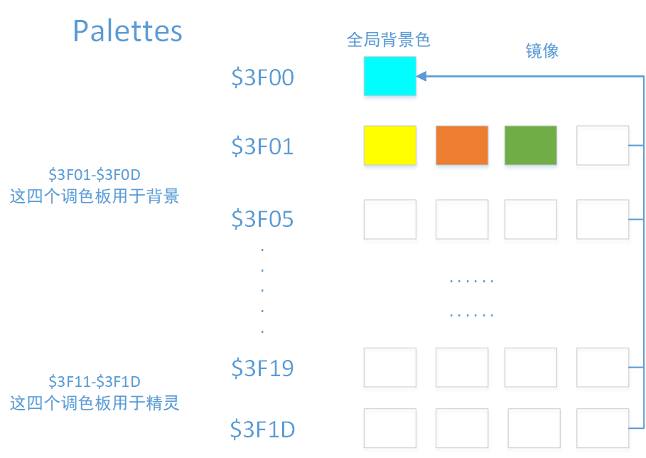
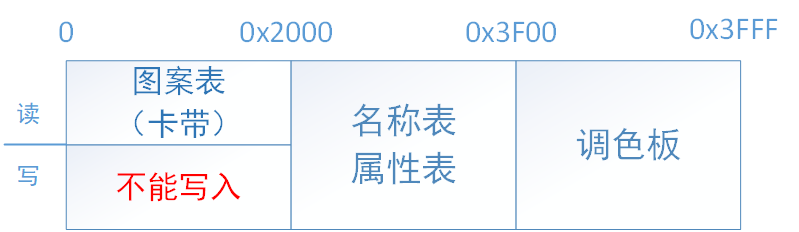
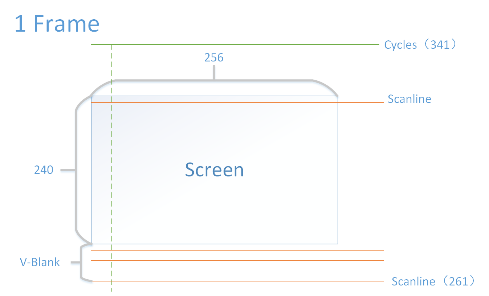
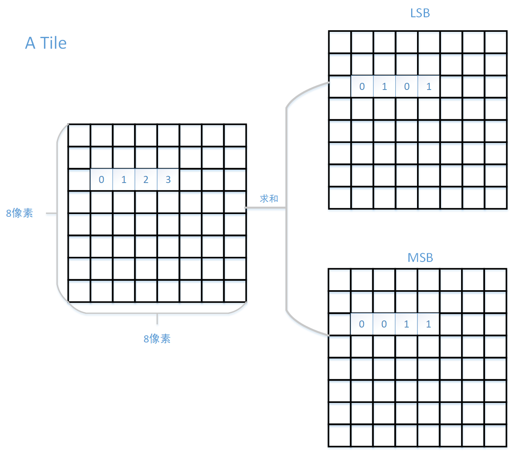
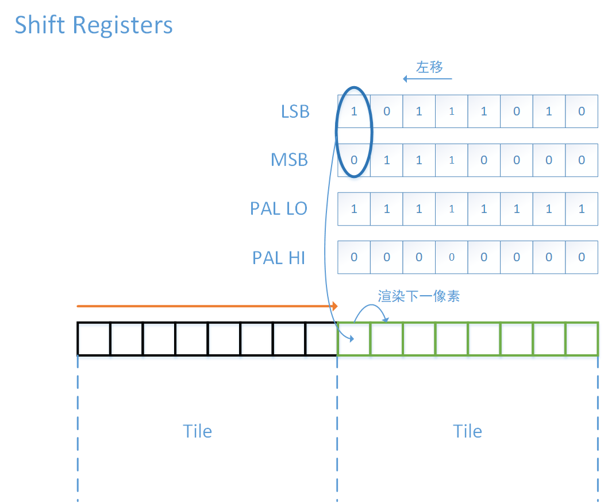

# FC PPU——背景显示

PPU是整个FC模拟器中最为困难的一部分

## 一、PPU总线

在运行游戏程序时，不仅需要CPU不断地执行游戏指令，还需要通过总线来实现数据传输。同样，在显示游戏画面时，不仅需要PPU来执行画面的逻辑操作，还包括显存空间(VRAM)，一条PPU总线来沟通PPU和显存。

特别的，显存与PPU总线是完全独立于RAM和CPU总线的，这意味着CPU不能通过PPU总线寻址，也不能直接访问显存。

PPU总线图如下：

## 二、显存

显存共包含三部分内容：名称表（Name Table）、属性表（Attribute Table）和调色板（Palette），它们与卡带中的图案表（Pattern Table）共同决定了游戏画面的背景。

### 2.1 名称表

FC的游戏画面为256x240(pixel)，名称表将其分为32x30个图案块，每个图案块上使用一个8x8(pixel)的点阵（称为瓦片，tiles）。名称表的作用就在于，决定每个图案块分别使用哪个点阵。

### 2.2 属性表与调色板

有了名称表，我们可以确定每个图案块使用哪个点阵，但我们还没有确定颜色。属性表和调色板共同决定了游戏的颜色，FC共有8个调色板（前四个给背景使用，后四个给精灵使用），每个调色板存放四种颜色组合。

属性表的作用是确定图像里的每个点阵分别使用哪个调色板。属性表本身有64字节，每个字节可以确定一个32x32(pixel)区域（32x32就是按像素计数，4x4就是按瓦片计数）使用的调色板。

由于可供背景使用的调色板只有4个，我们用2位即可表示，而属性表每字节有8位。因此我们可以进一步，把32x32(pixel)的区域划分为4个16x16(pixel)的区域，然后有图下对应关系：

1. 0-1位：左上角的16x16区域
2. 2-3位：右上角的16x16区域
3. 4-5位：左下角的16x16区域
4. 6-7位：左下角的16x16区域

这部分听起来可能有点乱，关于名称表、属性表、调色板之间的关系可以看下面这张图：

注意到上图中每个调色板的0号颜色均为透明色（并不准确，实际上是镜像了全局背景色，见下图），这点在最终确定颜色时很关键，具体将在下节精灵渲染中描述

### 2.3 游戏背景滚动

为了方便游戏背景滚动，显存中实际上有两个名称表，并通过一个寄存器确定图案的起始位置。这样在背景滚动时，每次只需要修改一列数据，大幅提高了更新效率

### 2.4 地址对应关系

## 3、图像显示流程

首先需要知道，PPU中显存的内容、滚动标志、以及其他的一些设置，都是CPU确定的。然而，CPU本身不能直接访问显存。

因此，PPU给CPU开放了8个寄存器（0x2000-0x2007），CPU向这些寄存器输入地址和数据，PPU将其转移到显存中。以下为这8个寄存器的具体功能：

1. 0x2000 PPU CTRL：CPU写PPU的控制设置（如：是否显示图像）
2. 0x2001 PPU MASK：CPU写PPU的图像显示设置（如：是否黑白）
3. 0x2002 PPU Status：CPU从PPU读取的状态标志
4. 0x2003 Write OAM_Addr：指向当前精灵数据的地址
5. 0x2004 Write OAM_Data：0x2003地址的精灵数据
6. 0x2005 Write_Scroll：屏幕滚动的起始坐标
7. 0x2006 Write Addr：指向当前显存的地址
8. 0x2007 Write Data：0x2006地址的显存数据

PPU在渲染图像时，每一帧包含262条扫描线，每条扫描线有341个时钟周期。（可以看作实际渲染画面为341x262，但是显示在屏幕上的只有256x240）。

一帧画面的渲染可见下图：

可以看到，scanline相当于y，而cycles相当于x。每处理完一行扫描线后，会跳转到下一行的行首，循环执行，到达屏幕底部时，并没有立即结束，实际上会一直到261行。超过240行的部分不可见，被称为VBlank（垂直消隐），这是在模拟老式显像管电视的刷新过程，但对于我们模拟器而言这是很重要的，我们必须及时通知游戏进入了VBlank阶段。

因为在渲染可视阶段时，CPU不可以对PPU做任何修改，否则会造成画面破坏，而在VBlank阶段就无所谓，因为本身就不可见。实际上，正是在VBlank这段时间内，CPU向PPU写入一些信息，来准备下一帧的渲染。PPU Status中有一位VBlank正是用来标志我们目前处于可视阶段，还是VBlank阶段。一般会在第240条扫描线渲染完毕后，向CPU发送一个NMI中断，CPU收到信号后，执行对新帧图像的写入等操作。（但这是一个可选操作，它由PPU CTRL中的nmi位控制）

对于我们的模拟器，当完成261行的渲染后，我们不会跳转到第0行，而是一个虚拟的“-1行”，这将有助于我们区分不同帧。

## 四、渲染时机

PPU的每个时钟周期该做什么事都有明确的指向，具体见下图(如果gitee显示不了可见[原图大图](http://wiki.nesdev.com/w/images/d/d1/Ntsc_timing.png))：

对上图中的一些名词做解释：

1. NT Byte：即0-2周期会从名称表读取下一个瓦片id
2. AT Byte：即2-4周期会从属性表读取下一个瓦片的属性id
3. Low BG tile byte：读取瓦片数值的低位信息
4. High BG tile byte：读取瓦片数值的高位信息

这里需要补充一些关于瓦片的说明。实际上，FC的每一个像素只能拥有4个值（因为每个调色板只有4种颜色），因此仅需要两位就可以表示一个像素值了。而这两位可以不在一起存储，即划分为LSB和MSB（Least/Most Significant Bit），当你要求某一个像素的值时，只需要将LSB和MSB加和即可，具体关系如下图：

由上图可知，一个瓦片需要16字节来存储。瓦片id就相当于该瓦片图案在图案表中的偏移量，我们只需要从该偏移量向后读取16字节，就可以获取该瓦片。该瓦片的属性id为其确认了调色板，而瓦片每一个像素的值确认了最终的颜色

1. Inc.hori(v)：一个瓦片是8x8像素，因此当渲染到一个瓦片边界时，我们需要进行瓦片切换（可能还会包括名称表的切换）
2. Inc.vert(v) && hori(v)=hori(t)：当渲染到一条扫描线的末尾时(可见部分末尾)，我们需要进行纵向移动，并且由于切换了扫描线，因此原本的横向信息不再正确，应当归零（即指向行首）

当然，上述中v和t寄存器都有它们专属的结构，这些可以具体见代码，不在这里赘述。但是有一个点是必须说明的，在FC的PPU中有一系列“移位寄存器”，称为Shifter。

沿着扫描线逐像素渲染的同时，总会提前加载后继将要渲染的8个像素信息，Shifter就是用来存储当前渲染的8个像素（存储于高8位），加上即将渲染的8个像素信息（存储于低8位）。每个渲染周期结束，意味着一个像素已经渲染完成，因此我们需要将其移出Shifter，故需要左移。

理论上，我们只需要每次取Shifter的最高位，即可渲染当前的像素，但这样我们只能渲染一个瓦片的边缘像素，可以想见如果进行滚动，渲染速度将跟不上画面变化。实际上，由于我们会存储一个瓦片内的精确位移（称为fine_x），所以在真正渲染时，我们不会选择最高位，而是根据fine_x的值决定选取那一个数值作为当前像素的值，这样就可以实现平滑滚动