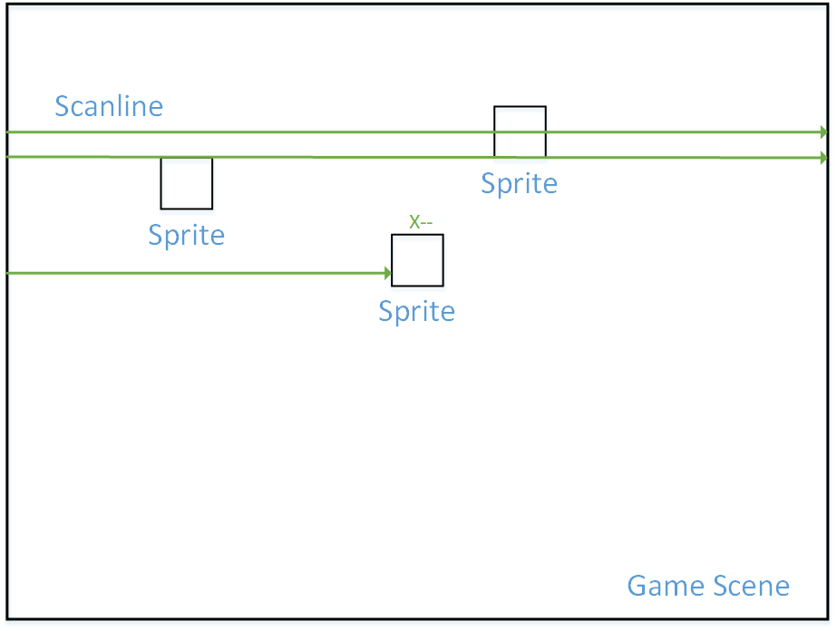

# FC PPU——精灵显示

上一节的背景完成之后，我们可以正常的运行超级马里奥兄弟1，但是奇怪的是——Mario呢？

## 一、精灵显示方式

在FC游戏中，所有可以进行位移的物体被称为“精灵”（Sprite），或“活动块”。

每个精灵对应一个8x8的点阵（部分精灵为8x16），例如：一个大马里奥的大小为16*32，占用8个精灵，见下图。

游戏的精灵数据存放在PPU内置的一块专用RAM中，PPU可以直接访问该区域而不需要经过总线。结构如下图：

## 二、精灵数据结构

精灵内存一共有256字节，包含了64个精灵信息，即每个精灵占用4个字节。这四个字节中包括了精灵的横纵坐标信息，使用的图案点阵信息以及其他渲染相关信息，具体结构如下：

## 三、精灵的绘制

精灵的绘制步骤与背景类似，分为如下几步：

1. 找到每个像素点可能出现的精灵
2. 确定这个精灵使用的图案点阵
3. 确定这个精灵使用的调色板
4. 确定这个精灵的颜色

对于某一个像素，我们需要综合精灵与背景的颜色来最终确定：

1. 当同一个像素点内有多个精灵时，以颜色非透明（上节说过，调色板0号为透明色）的精灵编号最小的精灵色为准。如下图，马里奥将显示于上方：

1. 当同一像素点内既有精灵又有背景时，会根据颜色是否透明，以及精灵在背景之上还是背景之下的配置来最终确定颜色。显示关系见下表：

| 精灵色 | 背景色 | 显示配置 |  最终结果  |
| :----: | :----: | :------: | :--------: |
|  透明  |  透明  |    --    | 全局背景色 |
|  透明  | 不透明 |    --    |   背景色   |
| 不透明 |  透明  |    --    |   精灵色   |
| 不透明 | 不透明 | 精灵在上 |   精灵色   |
| 不透明 | 不透明 | 背景在上 |   背景色   |

## 四、精灵数据写入

显然所有的数据最初都在卡带上，那么如何将其写入到PPU的内存上呢？

目前为止，能够直接访问精灵内存的只有PPU，如果通过CPU-CPU总线-PPU-精灵内存这条路线对其进行写入（一次只能写一字节），耗时过长。因此FC采用了DMA的方式，也即下图：

这种方式速度快很多，写入256字节仅需要514个时钟周期（走上面那条路至少1024个周期）

## 五、精灵的渲染流程

PPU在绘制精灵时，每完成一条扫描线的绘制就会加载下一条扫描线需要绘制的精灵列表，每行最多8个。这样，在确定每个像素点需要绘制的精灵时，只需要遍历这一行可能出现的8个精灵即可，不需要遍历全部64个。

我们只需要通过比较精灵的纵坐标与扫描线的纵坐标（相减，结果在0-精灵高度之间），即可确定下一条扫描线是否需要绘制该精灵。如果发现下一条扫描线上需要绘制的精灵数超过8个，则会将PPU_STATUS中的Sprite_Overflow标志置1。

现在我们存取了一条扫描线上的8个精灵，但我们需要在什么时候渲染它呢？由于没有fine_x来记录精灵的具体位置，所以我们没办法确认何时进行渲染。这里我们采用扫描线每前进一个周期，就将8个精灵的x坐标减1的方法，当其x坐标为0时，我们就可以对其进行渲染，并将Shifter左移了。

## 六、Sprite Zero Hit

在精灵的绘制中，有一个很有趣同时很重要的概念，被称作Sprite0Hit。我们知道，一个游戏中碰撞检测是一个很重要同时也很麻烦的机制，如果硬件能够帮助我们做那是最好的，不过FC并不能。然而，FC确实提供了一个单独的标志，它用来标识0号精灵是否和背景重叠。

它的作用是什么呢？其实是用来同步CPU和PPU的。我们知道，当扫描线进入241行，即刚刚完成可见部分渲染时，PPU会向CPU发送nmi信号，这其实就是一次同步，它用来告知CPU我们进入了垂直消隐阶段。然而，这一次同步并没有告知CPU，我们在渲染阶段进行到哪一条扫描线了。Sprite0Hit的作用，就是告知CPU，PPU这边纵向向下渲染到哪里了。你可能会问，这有什么意义吗？显然，一个游戏必然有一些UI界面，而UI界面不会随着背景滚动，他们应该维持在相对位置。所以我们可以挑选一些扫描线，使得UI相关的名称表，总是被UI信息填充，而不会随背景滚动变化。所以Sprite0Hit一般被用来做“屏幕分割”，即分割出UI部分和普通的背景。

一个比较具体的例子如下图：

