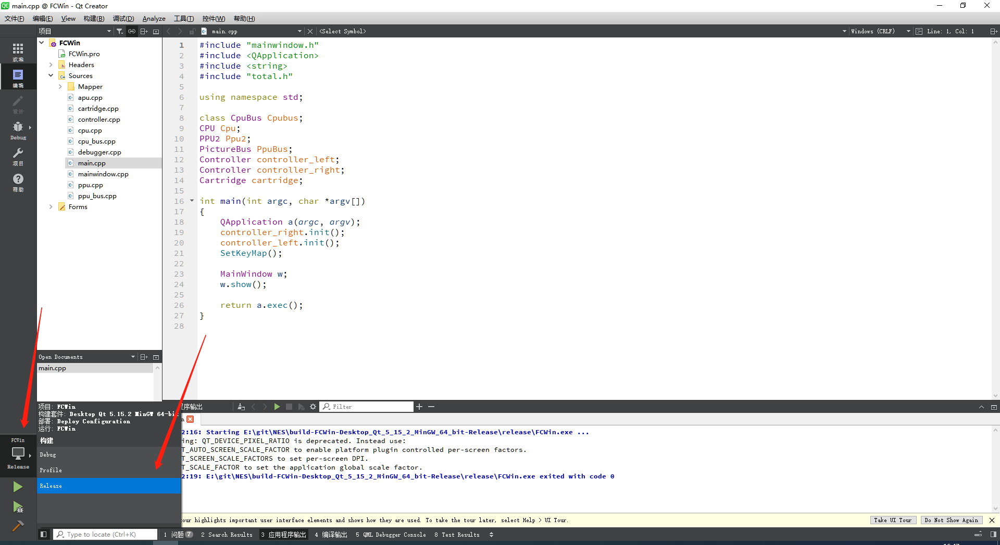
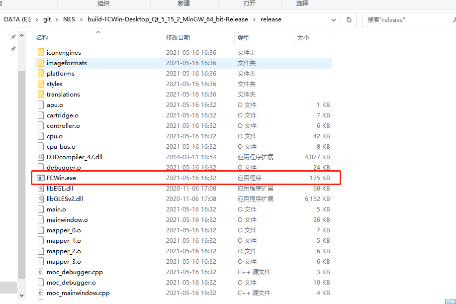

# Qt程序打包发布方法（使用windeployqt工具）

1. 首先使用Qt Creator把你的项目（我的项目名是FCWin）打开，按照如下方式进行编译：

1. 编译完成后，在你的根目录下（FCwin）应该会出现“build-FCWin-Desktop_Qt_5_15_2_MinGW_64_bit-Release\release”的文件夹，点击进去找到相应的exe，如图：

2. 将该exe文件转移到一个你新建的文件夹里（我存在了test文件夹中），然后打开CMD/Powershell进入到该文件夹中，执行命令“windeployqt.exe FCWin.exe”（Qt安装时应自动配置环境变量，所以可以全局调用），然后可以在文件夹里看到`windeployqt`工具自动复制的插件文件夹和 dll文件、qm文件。这时候得到的就完整的 exe 程序发布集合，依赖关系都解决好了。

3. 这时候理论上你可以运行的你的exe文件了，但是如果这时候你的exe仍显示缺少dll等相关文件，那么你需要**./Qt/Tools/mingw810_64/bin**中找到相应的dll文件，把它复制到exe的目录下即可。这一步当且仅当使用了STL库时才有可能需要，若使用Qt重构的容器则不需要。

4. 有时候使用CMD或PowerShell打包出来的应用会出现链接问题，这一般是因为你安装了多个编译器。一个更好的解决方法是，win+s调出搜索面板，输入qt，你应该看到一个qt专门的命令行程序，例如我是`Qt 5.15.2 (MinGW 8.1.0 64-bit)`，你应当使用该命令行进行3中的操作。
